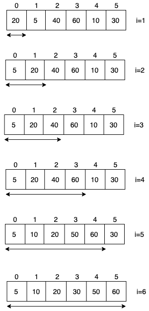
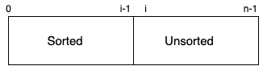

# Insertion Sort

- O(n<sup>2</sup>)
- In-place and stable
- Used in practice for small array (Tim Sort and Intro Sort)
- O(n) in best case




**Note:** It divides array into two sub array. 0 to i-1 is sorted and i to n-1 is unsorted. Since 0th element already sorted in 0-0 subarray, so we have started with i=1



```
package main

import "fmt"

func main() {
	arr := []int{10, 3, 25, 17, 21, 55}
	// arr := []int{3, 10, 17, 21, 25, 55}
	insertionSort(arr)
	fmt.Println(arr)
}

func insertionSort(arr []int) {
	for i := 1; i < len(arr); i++ {
		key := arr[i]
		j := i - 1
		for j >= 0 && arr[j] > key {
			arr[j+1] = arr[j]
			j--
		}
		arr[j+1] = key
	}
}
```

**Time Complexity**<br/>
**Best Case:** &theta;(n) if already sorted <br/>
**Worst Case:** &theta;(n<sup>2</sup>) if it is reverse sorted <br/>
**In General:**O(n<sup>2</sup>) <br/>