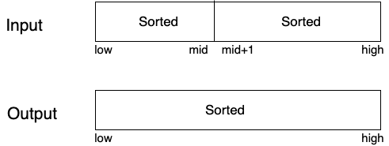
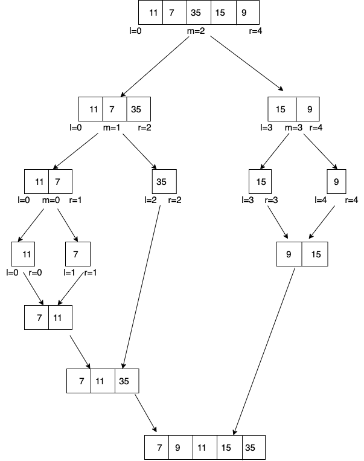

# Merge Sort

## Introduction
- Divide and Conquer Algorithm
    - Divide
    - Conquer
    - Merge
- Stable Algorithm
- &theta;(n log n) time and O(n) aux space
- Well suited for linked list. Works in O(1) aux space
- Used in external sorting
- In generate for array. Quick sort outperforms it.

## Merge Two Sorted Array

**Input:** a[] = {12, 17, 22} </br>
b[] = {7, 8, 8, 17} </br>
**Ouput:** c[] = {7, 8, 8, 12, 17, 22} </br>
</br>

**Input:** a[] = {11, 11, 22} </br>
b[] = {33} </br>
**Ouput:** c[] = {11, 11, 22, 33} </br>


### Naive Solution

```
package main

import (
	"fmt"
	"sort"
)

type Person struct {
	id   int
	name string
}

func main() {
	a := []int{10, 15, 20, 20}
	b := []int{1, 2, 13}
	c := merge(a, b)
	fmt.Println(c)
}

func merge(a []int, b []int) []int {
	c := make([]int, len(a)+len(b))
	for i, ele := range a {
		c[i] = ele
	}
	for i, ele := range b {
		c[len(a)+i] = ele
	}
	sort.Ints(c)
	return c
}
```

**Time Complexity:** O((m+n) log(m+n)) </br>
**Space Complexity:** &theta;(m+n)

**Dry Run:** </br>
a[] = {10, 15, 20, 20} </br>
b[] = {1, 2, 13} </br>
 
*After 1st Loop:* c[] = {10, 15, 20, 20, _, _, _} </br>
*After 2st Loop:* c[] = {10, 15, 20, 20, 1, 2, 13} </br>
*After Sorting:* c[] = {1, 2, 10, 13, 15, 20, 20} </br>


### Efficient Solution


Initially i=0, j =0

if a[i] <= b[j] { append a[i]; i++} </br>
else append b[j]; j++

```golang
package main

import "fmt"

func main() {
	a := []int{5, 10, 15, 20}
	b := []int{10, 20, 30}
	res := merge(a, b)
	fmt.Println(res)
}

func merge(a []int, b []int) (result []int) {
	i := 0
	j := 0
	for i < len(a) && j < len(b) {
		if a[i] <= b[j] {
			result = append(result, a[i])
			i++
		} else {
			result = append(result, b[j])
			j++
		}
	}

	for i < len(a) {
		result = append(result, a[i])
		i++
	}
	for j < len(b) {
		result = append(result, b[j])
		j++
	}
	return
}
```

**Time Complexity:** &theta;(m+n)

**Dry Run:**</br>
a := {5, 10, 15, 20} </br>
b := {10, 20, 30}

*First Loop*</br>
i=0, j=0 </br>
c[]={5}  i=1 </br>
c[]={5, 10}  i=2 </br>
c[]={5, 10, 10}  j=1 </br>
c[]={5, 10, 10, 15}  i=3 </br>
c[]={5, 10, 10, 15, 20}  i=4 </br>

*Second Loop* </br>
Nothing

*Third Loop* </br>
c[]={5, 10, 10, 15, 20, 20}  j=2 </br>
c[]={5, 10, 10, 15, 20, 20, 30}  j=3 </br>

## Merge Function of Merge Sort

**Input:** a[] = {12, 15, 22, 13, 32}</br>
&nbsp; &nbsp; &nbsp; &nbsp; &nbsp; &nbsp; &nbsp; &nbsp; &nbsp; &nbsp; &nbsp;|---------|  &nbsp; &nbsp; |-----| </br>
low = 0 </br>
mid = 2 </br>
high = 4 </br>

**Output:** a[] = {12, 13, 17 , 22, 32}
</br>

**Input:** a[] = {7, 10, 12, 14, 9}<br>
&nbsp; &nbsp; &nbsp; &nbsp; &nbsp; &nbsp; &nbsp; &nbsp; &nbsp; &nbsp; &nbsp;|-------------| &nbsp;|--| </br>
low = 0 </br>
mid = 3 </br>
high = 4 </br>

**Output:** a[] = {7, 10, 12, 14, 9}



### Implementation Idea

a[] = {13, 18, 21, 45, 10, 15, 80}</br>
low = 0 </br>
mid = 3 </br>
high = 6 </br>
left[] = {13, 18, 21, 45} </br>
right[] = { 10, 15, 80}</br>

*merge left and right array* <br>
a[] = {10, 13, 15, 18, 21, 45, 80}


### Implementation

```golang
func merge(a []int, low int, mid int, high int) {

	// Setting up auxilary array
	n1 := mid - low + 1
	n2 := high - mid
	left := make([]int, n1)
	right := make([]int, n2)
	for i := 0; i < n1; i++ {
		left[i] = a[low+i]
	}
	for i := 0; i < n2; i++ {
		right[i] = a[mid+i+1]
	}

	// standard merge logic

	i := 0
	j := 0
	k := low
	for i < n1 && j < n2 {
		if left[i] < right[j] {
			a[k] = left[i]
			i++
			k++
		} else {
			a[k] = right[j]
			k++
			j++
		}
	}
	for i < n1 {
		a[k] = left[i]
		k++
		i++
	}
	for j < n2 {
		a[k] = right[j]
		k++
		j++
	}
}

```

**Time complexity:** &theta;(n) </br>
**Aux Space:** &theta;(n) 
## Merge Sort Algorithm

```golang
func mergeSort(arr []int, l, r int) {
	if r > l { // atleast 2 elements
		m := (l + r) / 2
		mergeSort(arr, l, m)
		mergeSort(arr, m+1, r)
		merge(arr, l, m, r)
	}
}
```

### Explaination


## Merge Sort Analysis