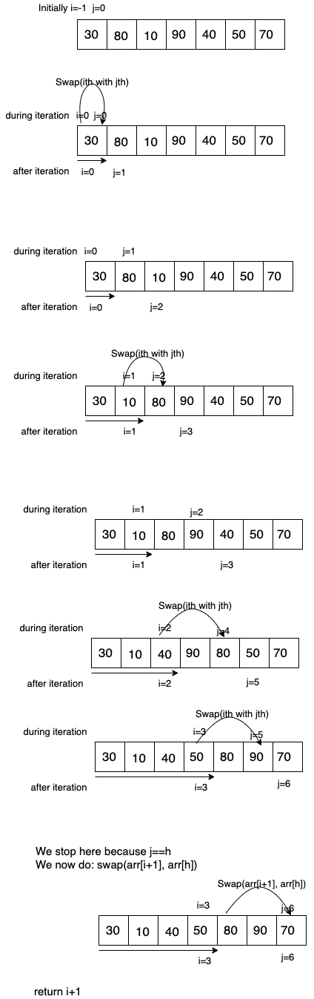

# Quick Sort

## Partition a Given Array

**Input:** arr[] = {13, 16, 22, 20, 17} </br>
pivot = 5 </br>
**Output:** arr[] = {13, 16, 17, 22, 20}  </br>
or </br>
arr[] = {16, 13, 17, 22, 20}
return value: 2 </br>
It is a new index of pivot element
```
Stability in Partition
├── Stable
│   └── Naive Partition
└── Not Stable
    ├── Lomuto Partition
    └── Hoare's Partition
```

## Naive Partition


**Input:** arr[] = {12, 17, 18, 13, 17} </br>
pivot = 1 or 4 </br>
**Output:** arr[] = {12, 13, 17, 17, 18}
return value = 3</br>

**Note:** Please note in the return value on above example that we return the last index of 17 i.e. 3, even our pivot is 1 or 4. So we  need to return the last occurrence of pivot element as explained in above example.

### Implementation

```
package main

import "fmt"

func main() {
	arr := []int{30, 80, 40, 90, 10, 50, 70}
	p := partition(arr, 0, len(arr)-1, len(arr)-1)
	fmt.Println(p) // 4
	fmt.Println(arr) // [30 40 10 50 70 80 90]
}

func partition(arr []int, l, h, p int) int {
	temp := make([]int, h-l+1) // create temp array
	idx := 0

	for i := l; i <= h; i++ {
		if arr[i] < arr[p] {
			temp[idx] = arr[i] //Smaller in temp array
			idx++
		}
	}

	for i := l; i <= h; i++ {
		if arr[i] == arr[p] {
			temp[idx] = arr[i] // equal elements in temp. We could do thi sin first loop but we need this loop for stability
			idx++
		}
	}

	res := l + idx - 1 // last ocurrance of pivot

	for i := l; i <= h; i++ {
		if arr[i] > arr[p] {
			temp[idx] = arr[i] // greator elements in temp
			idx++
		}
	}

	for i := l; i <= h; i++ {
		arr[i] = temp[i] // copy to original array
	}

	return res
}

```

#### Complexity

*Time Complexity:* &theta;(n) </br>
*Aux Space Complexity:* &theta;(n)

#### Dry Run

arr[] = {5, 3, 12, 8, 5}</br>
l=0, h=4, p=0

After 1st loop temp[] = {3, _, _, _, _} </br>
After 2nd loop temp[] = {3, 5, 5, _, _} </br>
After 3nd loop temp[] = {3, 5, 5, 12, 8} </br>
After 4th loop arr[] = {3, 5, 5, 12, 8} </br>

## Lomuto Partition

arr[] = {10, 80, 30, 90, 40, 50, 70} </br>
l=0, h=6, pivot=70

Lomuto partition always selects the last element s pivot element.


As above diagram explains, the Lomuto partition moves *< pivot* elements into 0 --> i section and keeps *>=pivot* elements intp i --> j section.

### Implementation

```
package main

import "fmt"

func main() {
	arr := []int{30, 80, 10, 90, 40, 50, 70}
	p := lomutoPartition(arr, 0, len(arr)-1)
	fmt.Println(p)
	fmt.Println(arr)
}

func lomutoPartition(arr []int, l, h int) int {
	p := arr[h]
	i := l - 1
	for j := l; j < h; j++ {
		if arr[j] < p {
			i++
			arr[i], arr[j] = arr[j], arr[i]
		}
	}
	arr[i+1], arr[h] = arr[h], arr[i+1]
	return i + 1
}
```
#### Complexity
*Time Complexity:* O(n) </br>
*Aux Space Complexity:* O(1) </br>

#### Dry run




#### Cornor cases

Dry run yourself:

1. {70, 60, 80, 40, 30}  ==> No small value than pivot
2. {30, 40, 20, 50, 80}  ==> No large value than pivot